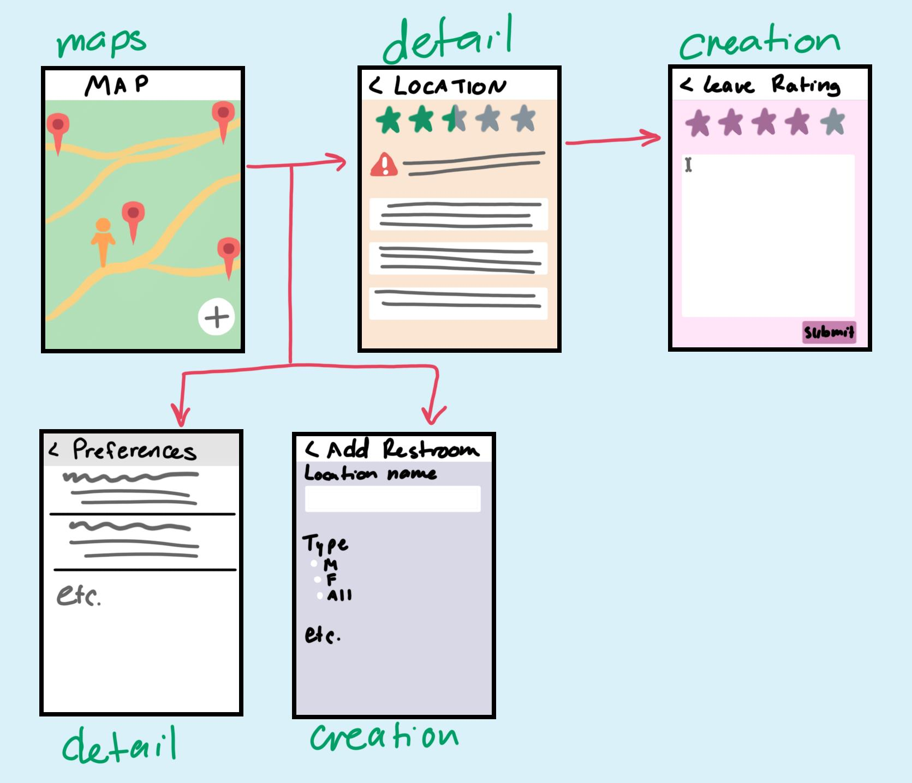

Original App Design Project - README Template
===

# TOILET PIRATES

## Table of Contents
1. [Overview](#Overview)
1. [Product Spec](#Product-Spec)
1. [Wireframes](#Wireframes)
2. [Schema](#Schema)

## Overview
### Description
An app that displays the locations of nearby toilets/restrooms through the use of GPS.

### App Evaluation
- **Category:** Health
- **Mobile:** App is primarily designed for mobile devices
- **Story:** Collect submitted information from users and display them in a way easy to parse through.
- **Market:** Individuals who need to locate a restroom (in its current state, must be on CPP campus)
- **Habit:** The app would be used any time you need to find/rate a restroom.
- **Scope:** We would start by using our own database to store the restroom locations/ratings. The app could potentially be implemented into Google maps.

## Product Spec

### 1. User Stories (Required and Optional)

**Required Must-have Stories**

* User can find themselves and any restrooms on a map
* User can see details of a restroom (opens a new screen)
* User can see/rate/comment on the location and cleanliness of the restroom
* User can filter restrooms shown (Male/Female/All Gender/No Filter)
* User can add restroom in a location

**Optional Nice-to-have Stories**

* User can see/add/resolve supply warnings (e.g. "Restroom is out of paper towels"); warnings are time-stamped and resolved in an hour if untouched (in case custodial staff resolve the issue)
* User can search restrooms

### 2. Screen Archetypes

* Map Screen
   * User can see their location and location of restrooms in their proximity
* Preferences
    * User can change filters on what restrooms are shown
* Add Restroom
    * User can add a restroom if one does not exist in the area
* Restroom Detail
   * User can see details of a selected restroom
* Rating
    * User can add details/rating/comments about a restroom

### 3. Navigation

**Tab Navigation** (Tab to Screen)

* Map Screen

**Flow Navigation** (Screen to Screen)

* Map Screen
  => Preferences
* Map Screen
  => Add Restroom
* Map Screen
  => Restroom Detail
* Restroom Detail
  => Rating

## Wireframes
[Add picture of your hand sketched wireframes in this section]

### [BONUS] Digital Wireframes & Mockups

### [BONUS] Interactive Prototype

## Schema 
[This section will be completed in Unit 9]
### Models
[Add table of models]
### Networking
- [Add list of network requests by screen ]
- [Create basic snippets for each Parse network request]
- [OPTIONAL: List endpoints if using existing API such as Yelp]
